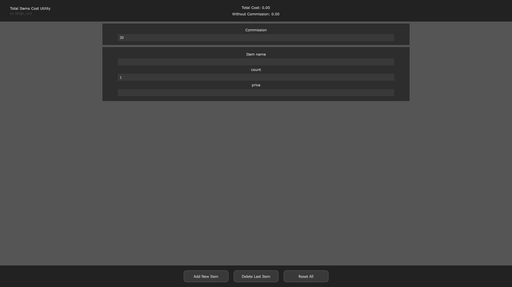

# Total Items Cost Utility


A browser-based utility for calculating total cost of items with commission, built using vanilla JavaScript and MVVM architecture.

## Features

* ✅ Add, delete, and reset items dynamically
* ✅ Real-time calculation of total cost and cost without commission
* ✅ Adjustable item count and price
* ✅ Commission input with automatic recalculation
* ✅ Input validation for numeric fields
* ✅ Responsive layout for desktop & mobile

## Tech Stack

* HTML
* CSS
* JavaScript (MVVM)

## How to Run

### 🌐 Online

Open the live version:
👉 https://spqr2235.github.io/total-items-cost-utility

---

### 💻 Local

1. Clone the repository

   ```bash
   git clone https://github.com/SPQR2235/total-items-cost-utility
   ```
2. Open `index.html` with local server
